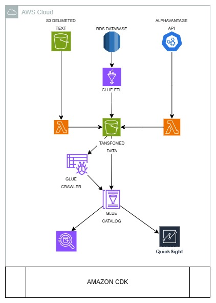

# AWS Lambda Data Pipeline Project

This project is an AWS Lambda-based data pipeline that retrieves and processes historical and intraday stock and Forex data. The pipeline uses multiple AWS services, including Lambda, S3, CloudWatch, and others, to automate the collection, conversion, and storage of stock data for analysis.

## Table of Contents

- [Project Overview](#project-overview)
- [Architecture](#architecture)
- [Setup Instructions](#setup-instructions)
- [Deployment](#deployment)
- [Usage](#usage)
- [Troubleshooting](#troubleshooting)

## Project Overview

The goal of this project is to build a serverless data pipeline using AWS services to automate the collection and processing of historical and real-time stock and Forex data. The data is retrieved from external APIs, processed using AWS Lambda functions, and stored in S3 buckets for further analysis and visualization.

## Architecture

The data pipeline consists of several components, as shown in the diagram below:



### Key Components

- **S3 Bucket**: Stores raw delimited text data.
- **RDS Database**: Houses structured data for further processing.
- **Glue ETL**: Performs extract, transform, load (ETL) operations on data.
- **Lambda Functions**: Fetch data from APIs (e.g., AlphaVantage) and perform transformations.
- **Glue Crawler**: Automatically catalogs the data stored in S3.
- **Glue Catalog**: Manages metadata and schema information.
- **QuickSight**: Provides data visualization and insights.
- **Amazon CDK**: Manages infrastructure as code for deploying the entire pipeline.

## Setup Instructions

### Prerequisites

- AWS CLI installed and configured with appropriate credentials.
- AWS CDK (Cloud Development Kit) installed.
- Python 3.9 or later installed.
- Node.js installed for AWS CDK.
- An AWS account with the necessary permissions to create IAM roles, Lambda functions, S3 buckets, etc.

### Installation

1. **Clone the Repository**

   ```bash
   git clone https://github.com/LogicAL007/serverless-pipeline-with-aws-cdk.git
   cd serverless-pipeline-with-aws-cdk
   ```

2. **Set Up a Virtual Environment**

   ```bash
   python3 -m venv venv
   source ./venv/bin/activate
   ```

3. **Install Dependencies**

   ```bash
   pip install -r requirements.txt
   npm install -g aws-cdk
   ```

4. **Configure Environment Variables**

   Copy the `.env.example` file to `.env` and fill in the required environment variables.

   ```bash
   cp .env.example .env
   ```

## Deployment

1. **Bootstrap the CDK Environment**

   ```bash
   cdk bootstrap
   ```

2. **Deploy the Stack**

   ```bash
   cdk deploy --all
   ```

   Follow the prompts to approve IAM policy and role changes.

3. **Verify the Deployment**

   - Check the AWS Management Console to ensure all resources are created correctly.
   - Verify that the Lambda functions are using the correct Python runtime (e.g., `python3.9`).


4. **Run the `backfill.py` script**

## Troubleshooting

- **Error: The runtime parameter of python3.7 is no longer supported**
  - Ensure all Lambda functions are using a supported runtime (`python3.9` or later). Search the project files for any references to `python3.7` and update them.

- **Stack Deployment Fails**
  - If the deployment fails, check the AWS CloudFormation console for detailed error messages. Delete the failed stack and try redeploying.

